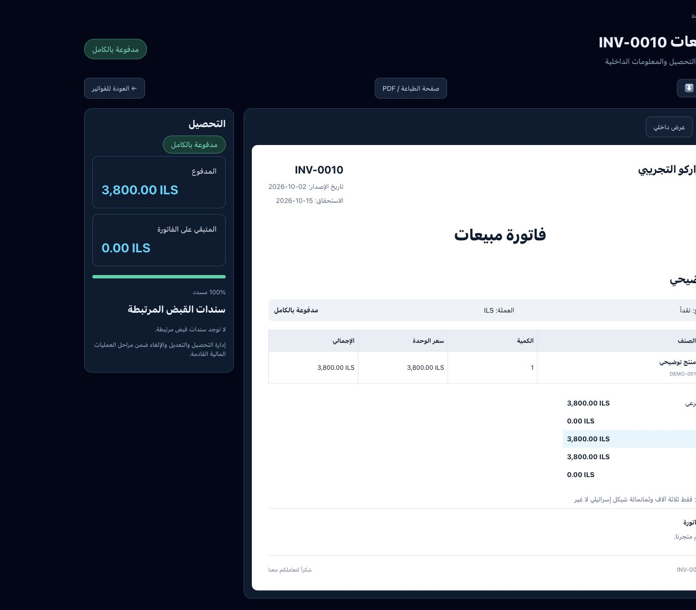
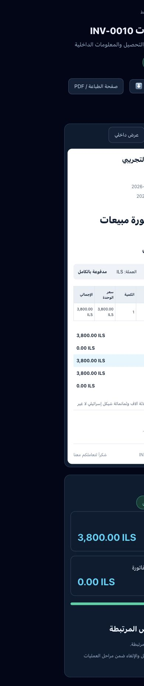

# الخطوة 11 — تفاصيل الفاتورة ومستند العميل

2026-10-02. التغييرات محلية ولم تنشر. لم تعدل قاعدة البيانات ولم ترسل رسائل.

## التنفيذ

واجهة تفاصيل عربية كحلية مع ورقة بيضاء للفاتورة، تبويبي نسخة الزبون والعرض الداخلي، حالة التحصيل ونسبة السداد والمدفوع والمتبقي، وروابط سندات القبض الفعلية والقيد والزبون والطلب المرتبط.

InvoiceDocument هو المستند المشترك بين التفاصيل ومسار الطباعة الرسمي؛ يشمل بيانات المتجر والعميل والتواريخ وSKU والكمية والأسعار والخصم والإجمالي والمدفوع والمتبقي والملاحظات العامة والتفقيط. محرك PDF يستهدف invoice-customer-document فقط. تكلفة البضاعة والربح خارج هذا العنصر وتختفي في الطباعة. لا يصف المستند نفسه ضريبياً تلقائياً لمجرد توفر رقم ضريبي للمتجر.

جلب تكلفة البنود محصور على الخادم بمالك المتجر أو عضوية owner/admin نشطة. لا ترسل تكلفة البنود إلى العميل؛ يرسل مجموع التكلفة للمصرح له فقط، بعد إسقاط البنود إلى الحقول العامة. لا يظهر الربح عند نقص التكلفة أو عند المسودة والإلغاء. هذه الحماية خاصة بالمسار الجديد وليست تدقيقاً شاملاً لسياسات RLS أو بقية API النظام.

حالة السداد تعتمد المبالغ مع إعطاء الأولوية للمسودة والملغاة. الربح يخصم خصم الفاتورة من الإيراد، ويعرض هامش مجمل الربح لا الهامش على التكلفة. سندات القبض مقيدة بمعرف المتجر والفاتورة؛ لا يفترض وجود سند إذا لم يوجد فعلياً. إرسال الإيميل الحالي متاح للمالك والفاتورة الفعالة فقط؛ لم يتم إرسال إيميل خلال الاختبار.

## التحقق

- npm run build نجح، بما يشمل فحص TypeScript.
- ثلاثة اختبارات نجحت: المسودة والملغاة، السداد وحدود التقدم، إسقاط الحقول الخاصة من بنود العميل.
- فحص قراءة فقط نجح لأعمدة المتجر وبنود الفاتورة وسندات القبض في القاعدة الحالية.
- مراجعة متصفح ببيانات توضيحية على 1440px و390px؛ عرض المستند على الهاتف 390px دون امتداد خارجه.
- العرض الداخلي أظهر التكلفة 3,000 والربح 800 والهامش 21.1%، بينما نص العنصر المستهدف للطباعة لا يحتوي هذه المعلومات.
- السداد الجزئي أظهر المدفوع 1,000 والمتبقي 2,800 والنسبة 26%.

## الحدود

لم تتحقق طباعة ورقية فعلية أو تنزيل PDF النهائي في متصفح عادي؛ تم التحقق من المستند المعروض والهدف المحدد لمحرك PDF الموجود. المستندات الطويلة تستخدم محرك PDF الحالي، وتحتاج مراجعة فصل الصفحات الفعلي عند كثرة البنود. مسارات التفاصيل والطباعة الرسمية تحتاج جلسة متجر مسجلة؛ المراجعة البصرية استخدمت المعاينة التطويرية.

أزيلت أزرار التحصيل والتعديل والإلغاء والحذف القديمة من واجهة التفاصيل الجديدة لأنها تستخدم عمليات غير ذرية لا تطابق حفظ الفاتورة الجديد. المسارات القديمة ما زالت قائمة ولم يصحح هذا العمل تنفيذها؛ يلزم تطوير العمليات المالية قبل إعادة هذه الأزرار. الملاحظات notes عامة وتدخل مستند العميل؛ لم يضف حقل ملاحظات داخلية جديداً.

التالي: الخطوة 12 — قائمة المنتجات.

