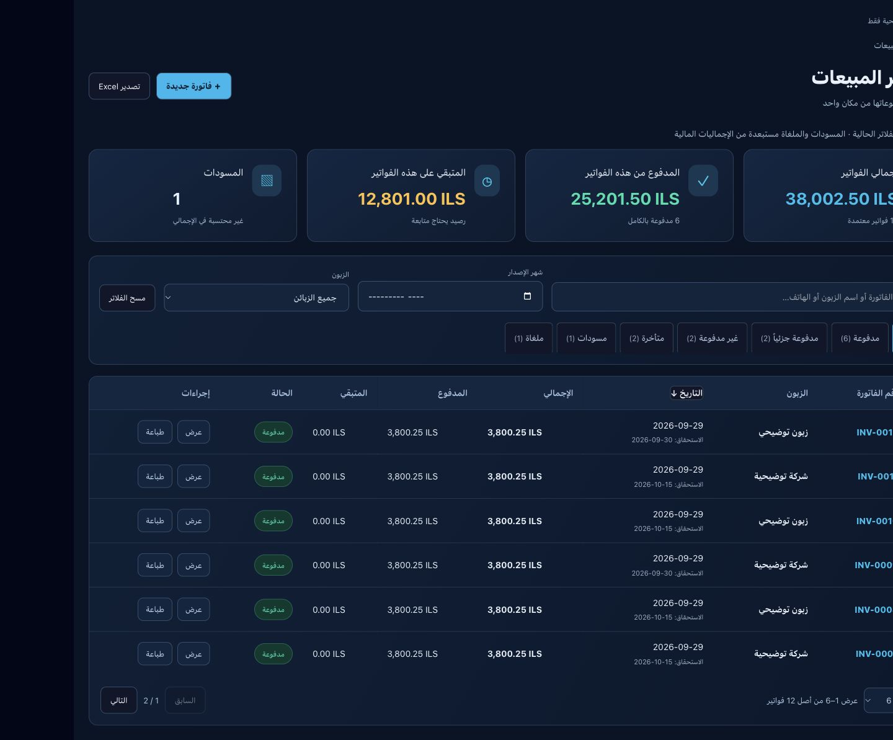
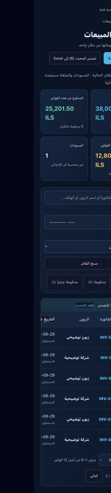

# الخطوة 10 — قائمة فواتير المبيعات

التاريخ: 2026-10-02. التنفيذ محلي ولم ينشر.

- واجهة عربية RTL بلون كحلي وسماوي، مؤشرات الإجمالي والمدفوع والمتبقي والمسودات، وجدول بأزرار العرض والطباعة الحالية.
- بحث برقم الفاتورة أو اسم الزبون أو الهاتف، فلتر شهر الإصدار والزبون، حالات السداد والتأخر والمسودات والملغاة، وترتيب التاريخ وترقيم 6/10/25/50.
- المؤشرات تشمل كل النتائج المطابقة للفلاتر وليس الصفحة وحدها. المسودات والملغاة مستبعدة من الإجماليات المالية. حالات السداد تعتمد المبالغ، والتأخر يبدأ بعد يوم الاستحقاق وفق تاريخ العمل.
- قراءة جميع الصفوف على دفعات 1000 ضمن متجر المستخدم، مع استبعاد الأنواع غير البيع والخدمة والسماح بالنوع الفارغ للبيانات القديمة. لا توجد تعديلات على قاعدة البيانات في هذه المرحلة.
- تصدير Excel لكل النتائج المطابقة أو الصفوف المحددة عبر الصفحات. المسح وتغيير الفلاتر يلغي التحديد. أزرار القائمة لا تنفذ تحصيلاً سريعاً أو إرسال رسائل.
- خطأ التحميل يظهر أرقاماً غير متاحة ويعطل التصدير، ولا يعرض صفراً باعتباره نتيجة حقيقية.

## التحقق

نجح npm run build وTypeScript، ونجحت خمسة اختبارات للحسابات وتداخل الفلاتر والتأخر والترتيب والترقيم وبيانات التصدير. نجح فحص قراءة فقط لتوفر الأعمدة المستخدمة في قاعدة المشروع؛ هذا ليس اختباراً مستقلاً لسياسات RLS.

راجعت المعاينة ببيانات توضيحية: الصفحة الثانية 7–12، فلتر المدفوع، البحث الذي خفض النتائج إلى ثلاث فواتير والإجمالي إلى 11,400.75، تحديد ست فواتير، وحالة فشل التحميل. عرض الهاتف 390px مطابق لعرض المستند ولا توجد زيادة أفقية خارجه؛ الجدول نفسه قابل للتمرير.

ضغط زر التصدير نجح دون ظهور خطأ واجهة، لكن المتصفح المدمج لم يرجع حدث تنزيل خلال المهلة؛ تنزيل الملف النهائي غير متحقق ويحتاج مراجعة في متصفح عادي. اختبارات بيانات التصدير ناجحة.

## الحدود والخطوة التالية

الفرز والفلاتر والترقيم على العميل بعد جلب الصفوف؛ المتاجر ذات أعداد فواتير كبيرة جداً تحتاج لاحقاً ترقيم الخادم وتجميعات قاعدة البيانات. لا يعيد هذا العمل كتابة حالات الفواتير القديمة أو تصحيح بيانات تحصيلها. تفاصيل الفاتورة ونسخة العميل والطباعة هي الخطوة 11 ولم تنفذ في هذه المرحلة.

