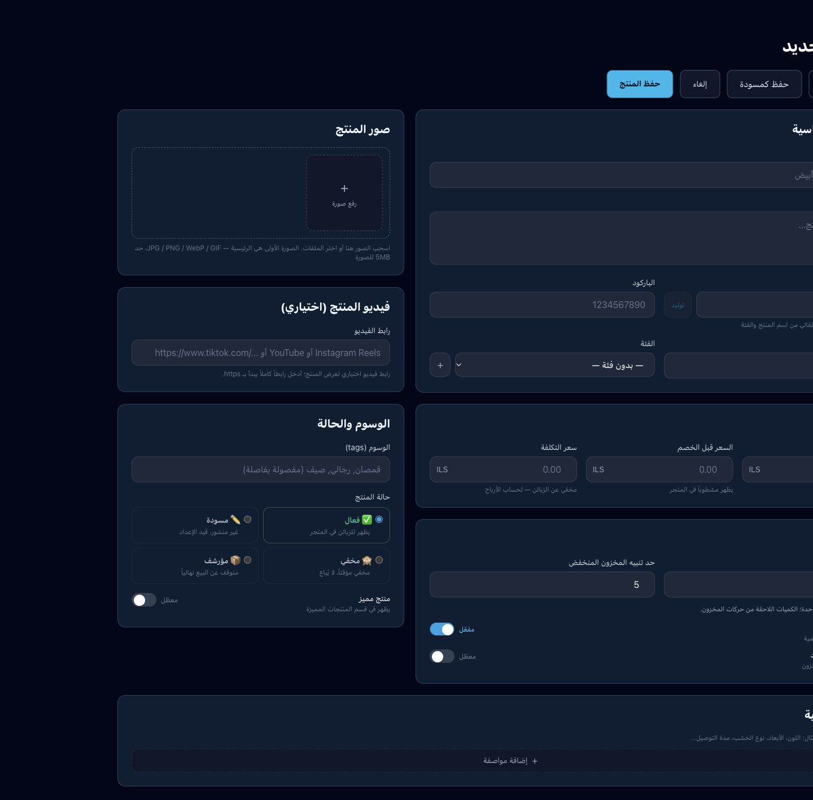
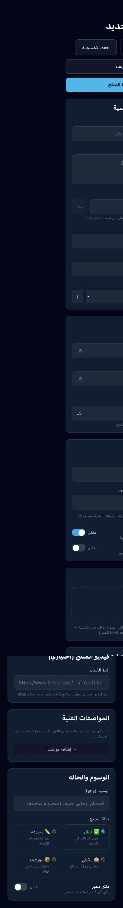

# المرحلة 13 — إنشاء وتعديل المنتج

2026-10-02. محلي دون نشر. المرجع 17 في فهرس الصور.

## التنفيذ

نموذج بعمودين: المعلومات والتسعير والمخزون يميناً، والصور والفيديو والوسوم والحالة يساراً. على الهاتف تظهر الأقسام في عمود واحد. أزرار العودة والحفظ والحفظ كمسودة والإلغاء في الأعلى. احتفظ النموذج بالمواصفات والخصائص والعملة الثانوية الموجودة.

الحفظ كمسودة يرسل draft وis_active=false؛ الحفظ العادي يزامن is_active مع حالة المنتج. تحقق واضح للاسم والأسعار غير السالبة بدقة منزلتين والسعر قبل الخصم والكمية الصحيحة وحد التنبيه وروابط الفيديو. سعر صفر وحد تنبيه صفر صالحان؛ لم يعد الصفر يتحول إلى 5.

الكمية الافتتاحية تدخل عند الإنشاء فقط. تعديل المنتج لا يرسل stock_quantity إطلاقاً، ويعرض الكمية للقراءة مع توضيح أن تغييرها من حركات المخزون. إعادة محاولة خصائص منتج أنشئ بالفعل تعيد استخدام معرفه ولا تعيد إرسال كمية افتتاحية. تغيير الظهور لا يغير الكمية.

رفع الصور يدعم السحب والإفلات والاختيار، وأنواع JPG/PNG/WebP/GIF وحد 5MB. يمكن اختيار الصورة الرئيسية وإزالة الصورة من النموذج بأزرار ظاهرة على الهاتف. الإزالة لا تحذف ملف Storage قد يستخدمه منتج آخر. المعاينة التطويرية تمنع رفع الملفات وحفظ المنتج وإضافة الفئة.

تعديل المنتج مقيد بمعرف المنتج والمتجر، ويتحقق من رجوع صف. خصائص المنتج تقرأ وتزامن ضمن المتجر؛ الروابط الجديدة تدخل قبل فصل القديمة. أخطاء الخصائص لا تظهر كنجاح كامل؛ يحتفظ النموذج بمعرف المنتج الذي حفظ فعلياً لإعادة المحاولة. الإنشاء غير المؤكد نتيجة انقطاع يمنع إعادة الحفظ داخل النموذج ويطلب مراجعة القائمة قبل إعادة الإنشاء.

فشل تحميل الفئات أو الخصائص أو روابطها يوقف فتح النموذج بدلاً من السماح بحفظ بيانات ناقصة وفقدان الروابط. صور منتج قديم له thumbnail دون images تبقى محفوظة عند فتحه.

## التحقق

نجح npm run build بما يشمل TypeScript. أربعة اختبارات نجحت للصفر والأسعار غير الصحيحة والمقارنة والكمية الافتتاحية مقابل التعديل والحالة ورابط الفيديو. فحص قراءة فقط نجح لأعمدة النموذج وجداول الخصائص.

مراجعة المتصفح: خطأ الاسم الفارغ، اسم يولد slug، إدخال حد تنبيه صفر، الحفظ المعطل في المعاينة، نموذج تعديل بكمية 12 للقراءة وحد صفر. الهاتف 390px دون زيادة في عرض المستند. لقطات الحاسوب والهاتف أدناه.

## الحدود

لم ينشأ منتج فعلي ولم يرفع ملف إلى Storage خلال الاختبار. الحفظ والتحقق في العميل والسياسات الحالية لقاعدة البيانات؛ لم تتحول العملية إلى RPC ذرية ولم يجر تدقيق شامل للصلاحيات. المنتج وخصائصه يمكن أن يحفظا جزئياً، ولذلك تظهر رسالة صريحة ولا ينتقل النموذج للقائمة عند فشل الخصائص. حماية الإنشاء المكرر بعد انقطاع ليست idempotency على قاعدة البيانات وتبقى الحاجة لمراجعة القائمة بعد إعادة تحميل الصفحة.

إزالة الصور قد تبقي ملفات غير مرتبطة في Storage؛ تنظيفها الآمن يحتاج مرحلة مستقلة. الحفظ كمسودة يتطلب اسماً وسعر بيع صريحاً؛ السعر صفر مقبول. الماركات والربط الفعلي بها في المرحلة 15.

التالي: 14 — كشف حركة الصنف والفلاتر والطباعة.

