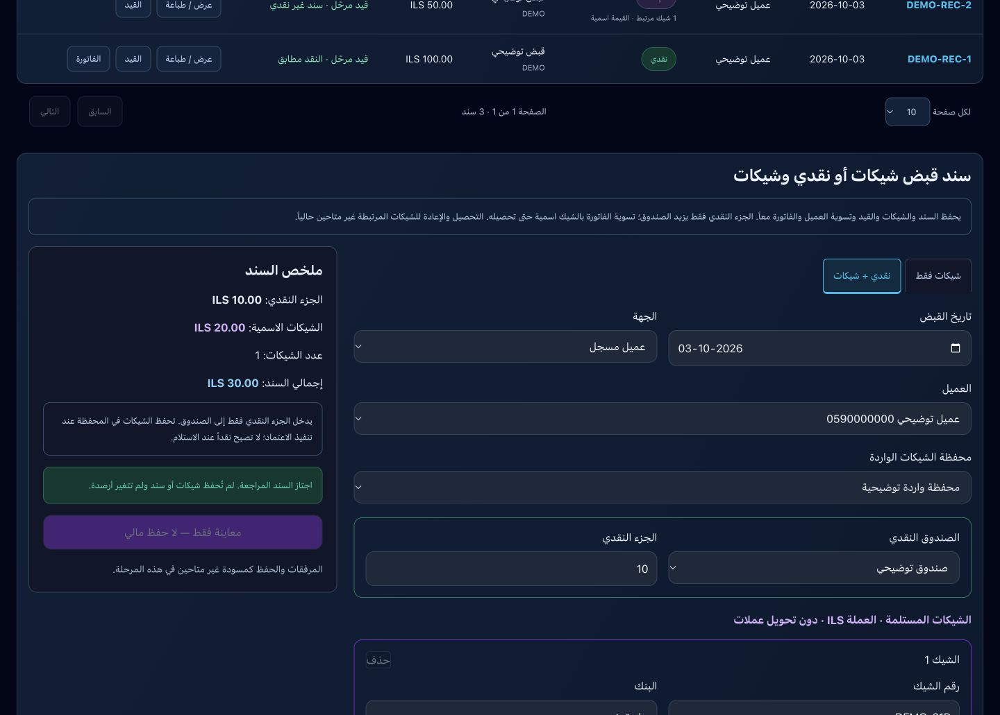
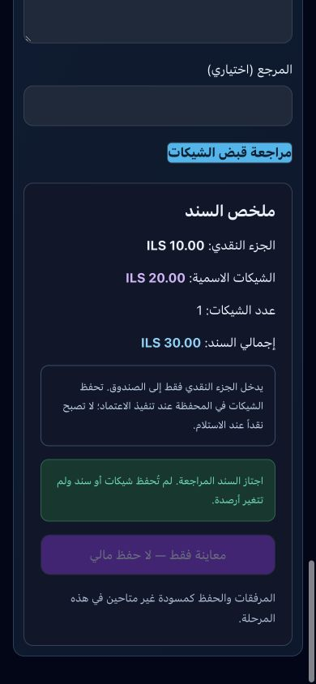

# 21ب1 — الحفظ الذري لقبض الشيكات والمختلط

أُنجز في 2026-10-03. استُكمل نموذج 21أ بالحفظ الفعلي. تحديث القاعدة 058 مطبق؛ التطبيق محلي ولم ينشر.

## النتيجة

- اعتماد السند يحفظ الشيكات والمحفظة والقيد وتسوية العميل والفاتورة بمعاملة واحدة. فشل أي خطوة يلغي كل الآثار.
- الشيك يسوي الذمة والفاتورة بالقيمة الاسمية، ولا يزيد النقد. القبض المختلط يزيد الصندوق بالجزء النقدي فقط؛ تحمل الشيكات محفظة مستقلة عن الصندوق.
- يحتفظ كل شيك بحساب المحفظة والحساب المقابل والفاتورة وحالة التسوية، كي يستخدمها مسار التحصيل والإعادة المقبل دون تخمين الحسابات.
- يراجع الخادم المتجر والعضوية والصلاحية الصريحة للموظف على المحفظة والصندوق، وعملة الحسابات ونشاطها، والفترة المقفلة، والعميل والفاتورة المتبقية والقيد الأصلي، وبيانات كل شيك.
- يرفض تكرار هوية الشيك المسجلة سابقاً، وتكرار رقمه داخل السند، والمبالغ غير الصالحة والتواريخ غير المتسقة.
- معرف الطلب محفوظ في sessionStorage قبل الإرسال. إعادة نفس الطلب ترجع السند نفسه؛ اختلاف البيانات بنفس المعرف مرفوض. النتيجة غير المؤكدة تجمد النموذج وتمنع فتح نموذج قبض آخر، مع استعادة الطلب بعد إعادة تحميل الصفحة.
- مسار إنشاء السندات القديم يوجه النقد والشيكات والمختلط إلى الصفحة الجديدة. السند الذري لا يقبل تعديل أو حذف المسار القديم.

## حد هذه الخطوة ونقطة الاستكمال

قُسمت 21ب إلى جزأين بسبب خلل مسار الشيكات القديم: لا يعكس تحصيل الفاتورة عند الإعادة، كما ظهر عدم تطابق مخططه عند الاختبار. **تحصيل وإيداع وإعادة وتجيير ونقل الشيكات الجديدة المرتبطة ممنوع حالياً** في المعاينة والتنفيذ ومشغل UPDATE/DELETE؛ لا تُعرض معاينة حسابية مضللة لها. يشمل المنع حتى المالك إلى حين استكمال 21ب2. لم تُغير بيانات أو دورة الشيكات القديمة؛ غُلّف RPC القديم بفحص العضوية ومنع السجلات الجديدة، وسُحبت صلاحية استدعاء النسخة القديمة مباشرة من public/anon/authenticated.

التالي **21ب2**: مسار ذري للتحصيل ينقل قيمة المحفظة إلى النقد/البنك دون تسوية العميل مرة ثانية؛ ومسار إعادة يعكس الحساب المقابل الأصلي ويعيد ذمة العميل ويخفض مبلغ الفاتورة المدفوع بدقة، مع حماية التكرار. بعدها المرحلة 22 للتحويلات البنكية والمرفقات. الإيداع والارتداد والتجيير تحتاج مسارات مرتبطة مستقلة؛ لا تعاد إلى الوظيفة القديمة.

لا مرفقات أو مسودات في هذه الخطوة، ولا تحويل عملات. تستخدم حسابات بعملة المتجر فقط. لم تُنفذ معاملات مالية حقيقية أو نشر للتطبيق. اختبار استعادة الطلب وانقطاع الاتصال عبر المتصفح لم يُجرَ فعلياً؛ حمايته موجودة في الكود، وحماية تكرار طلب الخادم اختُبرت فعلياً.

## التحقق

- `node --test tests/cheque-receipt-review.test.cjs tests/receipts.test.cjs`: 10 اختبارات ناجحة.
- `node tests/cheque-receipt-atomic.integration.cjs`: 26 تحققاً ناجحاً، تشمل الخالص والمختلط والتكرار والربط والرفض والصلاحيات والتراجع الكامل عند فشل متأخر ومنع المسارات القديمة. بيانات وDDL الاختبار جميعها داخل ROLLBACK.
- `node tests/cash-receipt-atomic.integration.cjs`: 34 تحققاً ناجحاً مع تطبيق 058 داخل معاملة الاختبار؛ لا تراجع في القبض النقدي.
- `npm run build`: ناجح، توليد 104 صفحات وفحص الأنواع. نجح `npx tsc --noEmit` بعد آخر تعديل لحماية معرف الطلب.
- تحقق Supabase بعد التطبيق: RPC متاح ويرفض طلباً دون مستخدم، دون أي كتابة مالية.
- معاينة نموذج مختلط: نقد 10 وشيك 20 وفاتورة متبقٍ عليها 30. زر الاعتماد معطل في المعاينة. تحقق الحاسوب والهاتف 390×844؛ عرض المحتوى 390 دون تجاوز أفقي.

## التحديث والملفات

`db/migrations/058_atomic_cheque_receipt.sql` مطبق. SHA-256:
`b44c0483963bf1e6434133105977a0d76fb575cb18c1efb4ea7cb4a44fbcfe6f`

تأكد وجود `create_cheque_receipt_atomic` وصلاحية authenticated، ومنع anon. لم تُعد كتابة معاملات موجودة.

الملفات الأساسية: `receipt-action.ts`، `ChequeReceiptReview.tsx`، `Receipts.tsx`، `cheque-review.ts`، `voucher-actions.ts`، `check-lifecycle-actions.ts`، migration 058 واختباراته.

