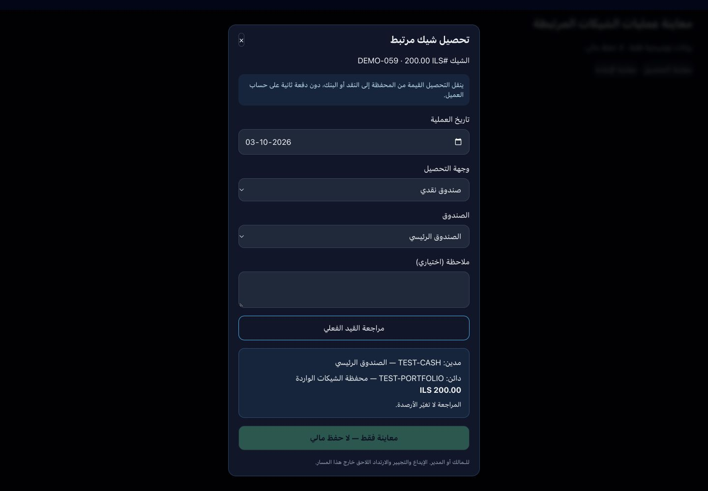
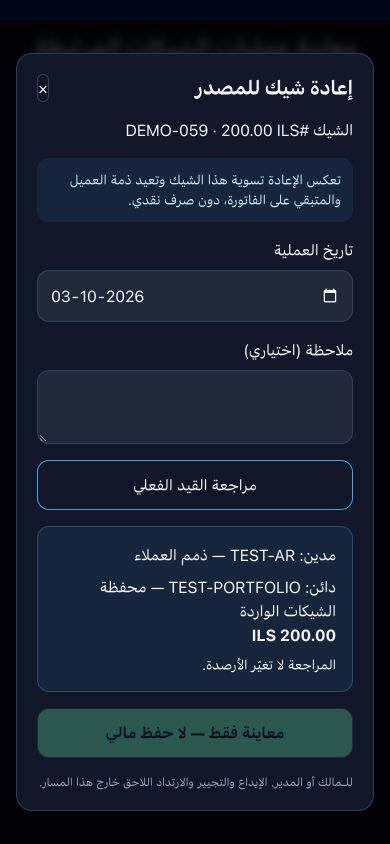

# 21ب2 — تحصيل وإعادة الشيكات المرتبطة ذرياً

تاريخ الإنجاز: 2026-10-03. تحديث قاعدة البيانات 059 مطبق؛ التطبيق محلي ولم يُنشر. نطاق المرحلة: الشيكات الواردة المنشأة بالحفظ الذري 058 وهي في المحفظة، والتحصيل الفعلي إلى صندوق نقدي أو حساب بنكي، والإعادة المباشرة إلى المصدر.

## السلوك المحاسبي

- التحصيل: مدين حساب الصندوق أو البنك الفعلي، دائن حساب المحفظة المحفوظ على الشيك. لا دفعة ثانية أو تغيير لذمة العميل أو المدفوع على الفاتورة. النقد له حركة `check_collect`؛ البنك يزيد رصيد الحساب البنكي دون تسجيل حركة نقدية.
- الإعادة: مدين الحساب المقابل الأصلي للقبض، دائن المحفظة. للعميل تُنشأ حركة تسوية مدينة ويُعاد رصيده ويُخفض total_paid بقيمة الشيك وحده. المدفوع على الفاتورة ينخفض بالقيمة نفسها؛ الحالة partial إن بقي مدفوع أو sent إن صار صفراً، وpaid_at يُمسح. نقد القبض المختلط يبقى دون رد.
- قبض الجهة الأخرى يعكس حسابه المقابل الأصلي دون إنشاء حركة عميل وهمية.
- السند الأصلي يبقى مستند استلام تاريخياً؛ عمليات الشيك وقيدها تسجل في check_operations وسجل التدقيق. يظهر نوع الشيك وفلاتره في صفحة سجل التدقيق.

## الحفظ والصلاحيات

`receipt_cheque_operation_atomic` يدعم المراجعة دون كتابة مالية والتنفيذ بالتحقق نفسه. يقفل المتجر بقفل معاملات مشترك مع إنشاء الفواتير والقبض، ثم الشيك والحسابات والعميل/الفاتورة عند الإعادة. يقيد العمليات بالمالك أو المدير النشط، والمتجر الصحيح، والحسابات النشطة بعملة المتجر ووسومها الفعلية، والربط بالقيد والسند الأصليين، والفترات المفتوحة، وحالة الشيك.

لكل عملية معرف طلب فريد على المتجر وحمولة محفوظة: نفس الطلب يرجع العملية نفسها؛ تغيير البيانات بنفس المعرف مرفوض. عملية جديدة على شيك محصل أو معاد مرفوضة. المعاينة تعرض أسماء ورموز الحسابات الموجودة فعلاً. الواجهة تحفظ الطلب قبل الإرسال، وتجمد المدخلات عند نتيجة غير مؤكدة، وتستعيد الطلب بعد إعادة تحميل الصفحة وتعيد المحاولة بالمعرف نفسه.

حماية قاعدة البيانات تمنع تعديل/حذف الشيك المرتبط خارج التحصيل أو الإعادة المطابقين لعملية مسجلة، وتمنع تغيير رابط التسوية مباشرة من العميل. سجل العملية الذري غير قابل للتعديل والحذف. المسار القديم لا يستطيع تشغيل الشيك المرتبط؛ يستخدم معرف طلب من النافذة الجديدة. سلوك الشيكات القديمة لم يُعد بناؤه في هذه المرحلة.

## الحدود ونقطة الاستكمال

- التحصيل والإعادة متاحان من **in_portfolio** فقط. لا إيداع برسم التحصيل أو تجيير أو نقل محفظة أو ارتداد لاحق أو إعادة قبض للشيك الجديد في هذا المسار؛ تبقى تلك العمليات محجوبة لحين مساراتها المرتبطة المناسبة.
- لا تحويل عملات. لا صرف نقدي من الإعادة. الفاتورة الملغاة أو ذات تسوية غير متطابقة تتطلب مراجعة؛ لا تُصلح آلياً.
- الموظف العادي لا ينفذ التحصيل أو الإعادة حتى لو كان مخولاً بإنشاء سند القبض؛ التنفيذ للمالك/المدير.
- لا مرفقات أو إلغاء بعد اعتماد العملية. لم يُختبر انقطاع الاتصال واستعادة sessionStorage في المتصفح فعلياً؛ الحماية موجودة بالكود، وإعادة الطلب في قاعدة البيانات اختُبرت فعلياً. لم يُجر اختبار ضغط متزامن؛ منع التزامن مبني على القفل والحالة والمعرف الفريد.
- صفحة الشيكات تحت بوابة الخطة الحالية؛ لم تُغير استحقاقات الاشتراك في هذه المرحلة.
- التالي **22: القبض البنكي والمرفقات وربطه بالفاتورة**. لا انتقال تلقائي.

## التحقق

- اختبارات دورة الشيك الذرية: 51 تحققاً ناجحاً داخل ROLLBACK، تشمل المراجعة دون آثار، التحصيل النقدي والبنكي، الإعادة من فاتورة مدفوعة، الإعادة الكاملة إلى sent، إبقاء نقد القبض المختلط، عكس جهة أخرى، إعادة الطلب، اختلاف الحمولة، الحالات الممنوعة، الفترة المقفلة، العملات، صلاحيات الموظف، حماية المستندات، والتراجع بعد فشل تدقيق متأخر.
- اختبارات إنشاء الشيكات والمختلط مع 059: 26 تحققاً ناجحاً داخل ROLLBACK.
- اختبارات القبض النقدي مع 059: 34 تحققاً ناجحاً داخل ROLLBACK.
- اختبارات المراجعة والملخصات: 10 ناجحة.
- البناء النهائي ناجح: 105 صفحات مع فحص الأنواع؛ ونجح tsc --noEmit.
- معاينة حاسوب 1440×1000 وهاتف 390×844، عرض المحتوى 390 دون تجاوز أفقي. البيانات والصور توضيحية وزر الحفظ معطل. القيد الفعلي في الخادم اختُبر ببيانات معزولة، لا معاملات مالية حقيقية.

## الملفات

- `db/migrations/059_atomic_receipt_cheque_lifecycle.sql`
- `app/dashboard/cheques/LinkedChequeOperation.tsx`
- `app/dashboard/cheques/check-lifecycle-actions.ts` و`ChequesClient.tsx`
- `app/dashboard/accounting/audit/page.tsx`
- رسائل نموذج/قائمة سندات القبض، اختبارات دورة الشيك والاختبارات السابقة، ومعاينة التطوير `/design-preview/cheque-operation`.

## تطبيق القاعدة

طُبق 059 دون إعادة كتابة المعاملات الحالية. تم التحقق من وجود RPC وصلاحية authenticated ورفض anon. تحقق Supabase بعد التطبيق أكد توفر RPC ورفض الطلب دون مستخدم، دون أي كتابة مالية. SHA-256:
`12b468e07c9ba982bcac578855aae7a51fccc6d0cd3fae2d4ce59cdd9911cb8c`
