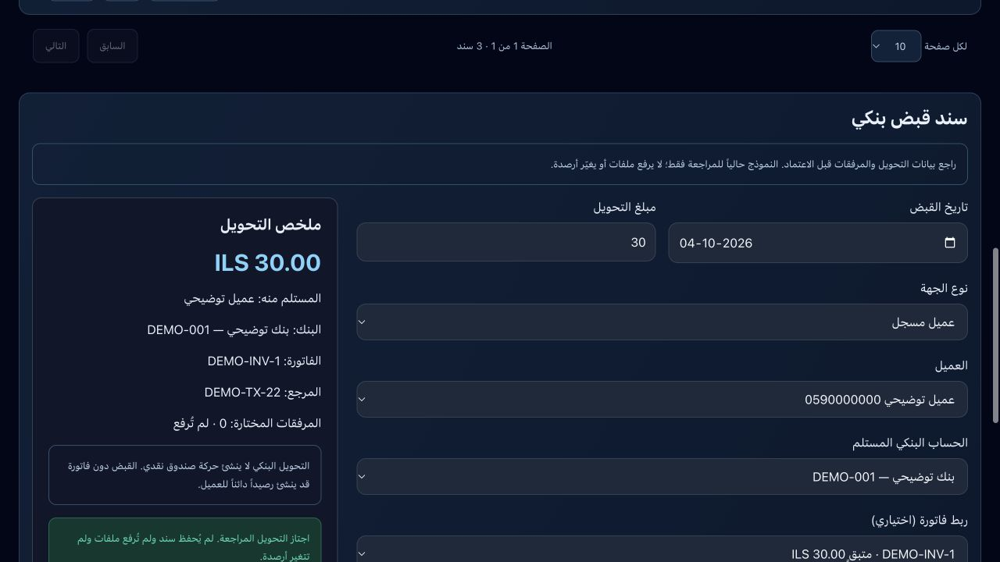
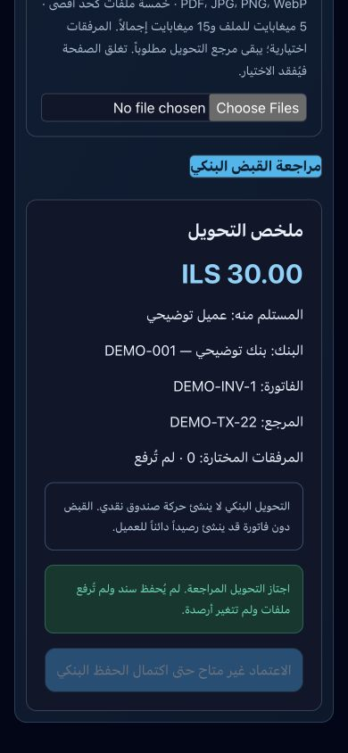

# 22أ — نموذج القبض البنكي ومراجعة المرفقات

أُنجز محلياً بتاريخ 2026-10-04. هذه خطوة واجهة ومراجعة فقط؛ لا تحديث قاعدة بيانات ولا رفع ملفات ولا أثر مالي ولا نشر. قُسمت المرحلة 22 إلى 22أ و22ب للمحافظة على خطوات قابلة للمراجعة وفق خطة العمل.

## المنفذ

- زر قبض بنكي في قسم سندات القبض، مع فتح نموذج مستقل وإغلاق نماذج النقد والشيكات. يمنع فتحه أثناء طلب نقد/شيكات غير مؤكد أو جارٍ تنفيذه.
- النموذج يدعم العميل المسجل أو جهة أخرى، تاريخ ومبلغ القبض، البنك المستلم، مرجع التحويل المطلوب، البيان، وربط فاتورة اختياري للعميل.
- القراءة من bank_accounts النشطة في المتجر بعملة المتجر؛ يجب أن يكون الحساب المحاسبي نشطاً وغير تجميعي وذا وسم BANK ونوع asset وطبيعة debit. القائمة للمالك أو العضو owner/admin الحالي؛ لا يوجد نظام تفويض قبض بنكي للموظف في هذه المرحلة.
- التحقق من المبلغ الموجب بمنزلتين عشريتين، العميل والفاتورة والمبلغ المتبقي وتاريخ الإصدار، مرجع التحويل، الحساب المقابل للجهة الأخرى، وعدم ربط الجهة الأخرى بعميل أو فاتورة.
- اختيار محلي لخمسة مرفقات اختيارية: PDF/JPG/PNG/WebP، حد 5 ميغابايت للملف و15 ميغابايت إجمالاً. رفض الملفات الفارغة والأنواع غير المقبولة والتكرار بالاسم والحجم والنوع. يمكن إزالة الملفات، وكل تغيير يلغي المراجعة.
- ملخص يوضح البنك والعميل والفاتورة والمرجع وعدد الملفات التي لم تُرفع. التحويل البنكي لا ينشئ حركة صندوق نقدي. زر الاعتماد معطل صراحة حتى اكتمال الحفظ.

## التحقق

- `node --test tests/bank-receipt-review.test.cjs tests/receipts.test.cjs tests/cheque-receipt-review.test.cjs`: 14 اختباراً ناجحاً. منها أربعة لاختيار البنك ومرجع التحويل والتسوية والجهة الأخرى وحدود الملفات.
- `npx tsc --noEmit` ناجح، والبناء ناجح مع 105 صفحات وفحص الأنواع.
- معاينة الحاسوب والهاتف 390×844: عرض المحتوى 390 دون تجاوز أفقي. تحويل 30 يطابق متبقي الفاتورة اجتاز المراجعة؛ 30.01 رُفض في المتصفح واختفت رسالة اجتياز المراجعة.
- لم يُختبر اختيار/إزالة ملف فعلي في المتصفح؛ حدود بيانات الملفات اختُبرت بوحدات الاختبار. لا ادعاء برفع أو حفظ مرفقات.
- لم تُختبر قراءة الصفحة مع جلسة إنتاج مسجلة دخولها في هذه الخطوة؛ المعاينة ببيانات توضيحية، مع تحقق الأنواع والبناء لمسار القراءة الفعلي.

## حدود ونقطة الاستكمال

التالي **22ب — الحفظ البنكي الذري ورفع المرفقات الخاصة**:

1. RPC يربط سند القبض والبنك والقيد والعميل والفاتورة في معاملة واحدة، دون حركة صندوق نقدي، بمعرف طلب يمنع التكرار، ويتحقق من الصلاحيات والفترة والعملات والربط بالخادم.
2. مرفقات في bucket خاص منفصل عن product-images العام. فحص محتوى الملفات وحدودها بالخادم، ربط مساراتها بالمتجر والطلب والسند، قراءة عبر روابط مؤقتة وصلاحيات مناسبة، ومعالجة الملفات اليتيمة أو فشل رفع/حفظ أحد الأجزاء دون ادعاء ذرية بين Storage وقاعدة البيانات.
3. استعادة الطلب غير المؤكد والرفع بعد انقطاع الاتصال، حماية السند من مسارات التعديل والحذف القديمة، اختبار الحفظ بصيغتي العميل والجهة الأخرى في معاملة تُلغى.
4. عدم فقدان ملفات مختارة بعد إغلاق النموذج بصمت عند إضافة الحفظ؛ حالياً تُفقد الملفات والمدخلات بإغلاق النموذج أو الصفحة لأنها محلية فقط.

حدود الملفات في المتصفح تحسين تجربة الاستخدام وليست ضمان صحة محتوى أو أمان رفع؛ التحقق الفعلي بالخادم جزء من 22ب. لا يستخدم هذا النموذج bucket الصور العام. بقية خطوات 23–27 لم تُنفذ في هذه الجلسة.

## الملفات

`BankReceiptReview.tsx`، `bank-review.ts`، صفحة وقائمة سندات القبض، معاينة receipts، واختبار `bank-receipt-review.test.cjs`.

